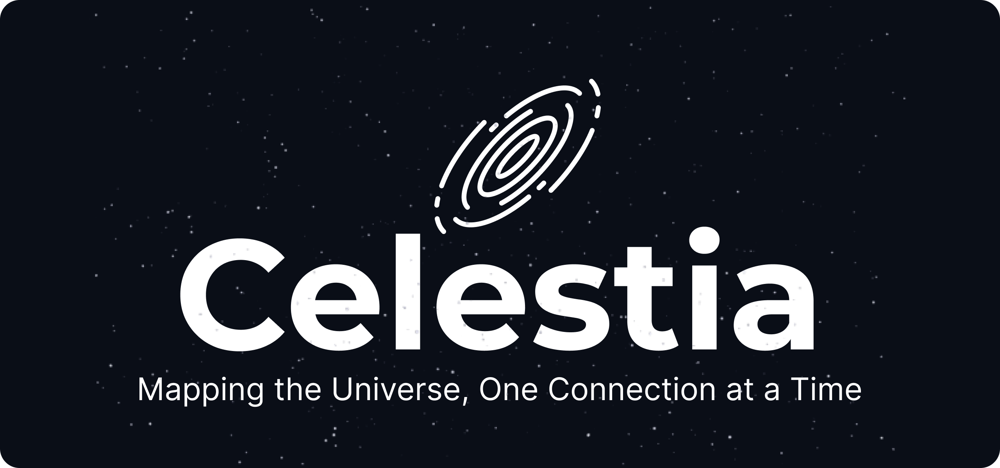
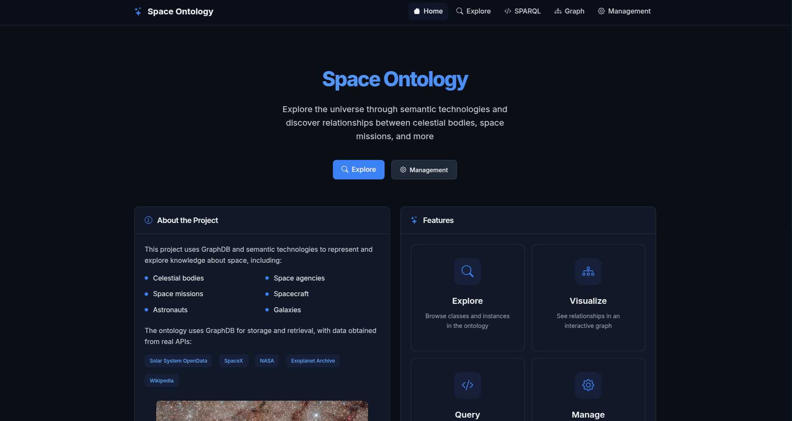
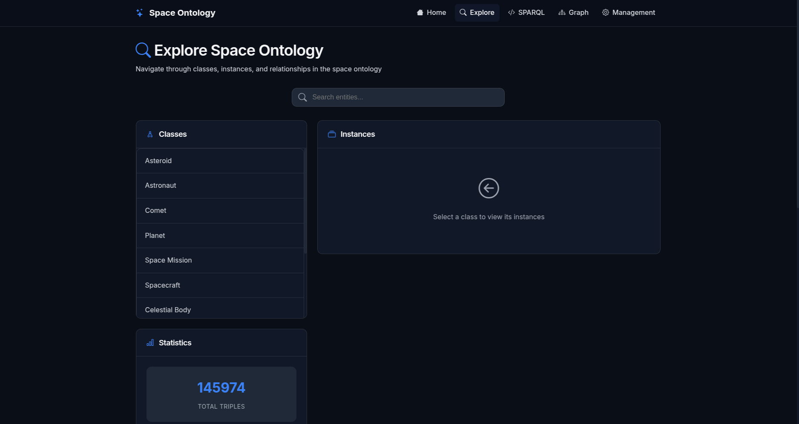
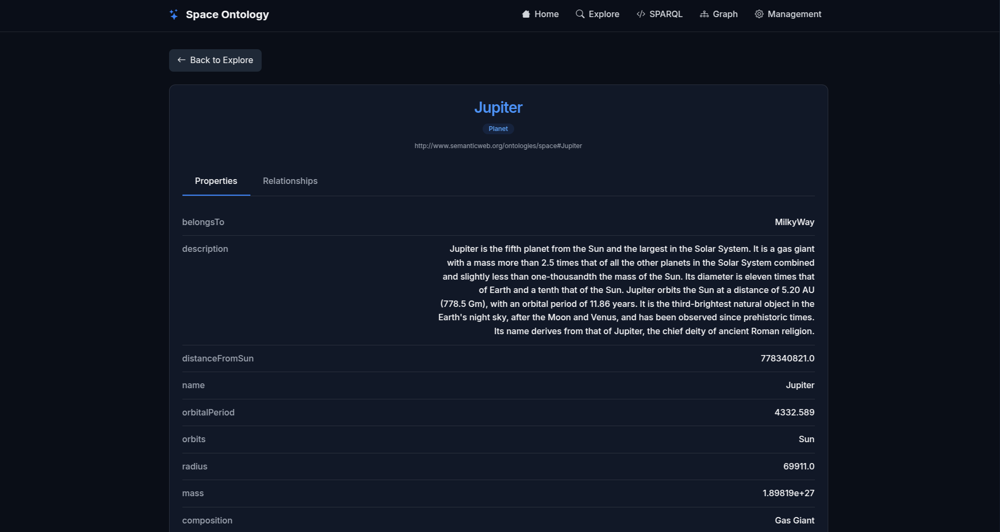
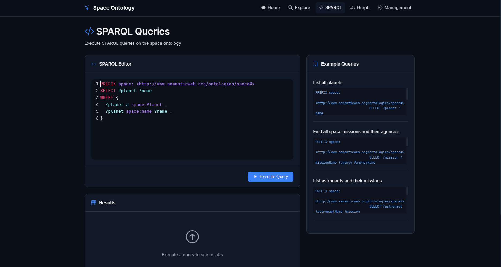
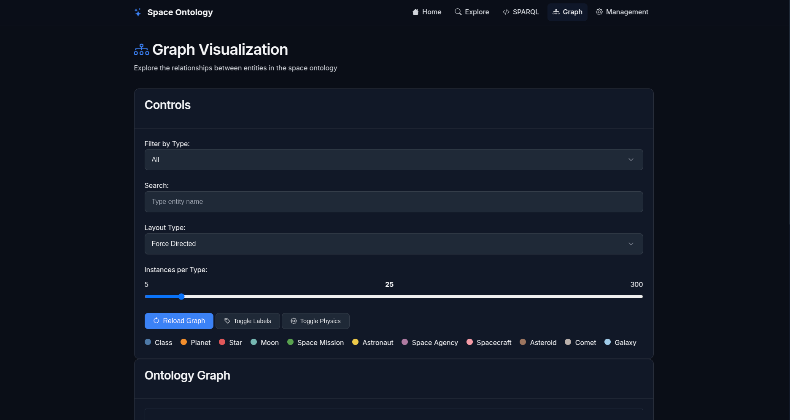
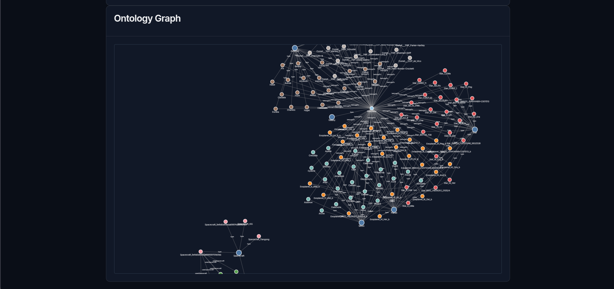
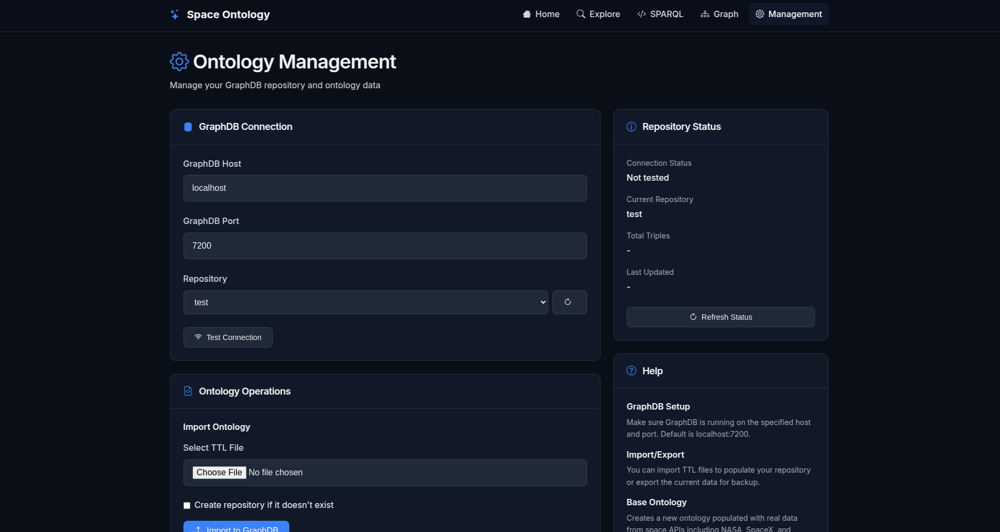
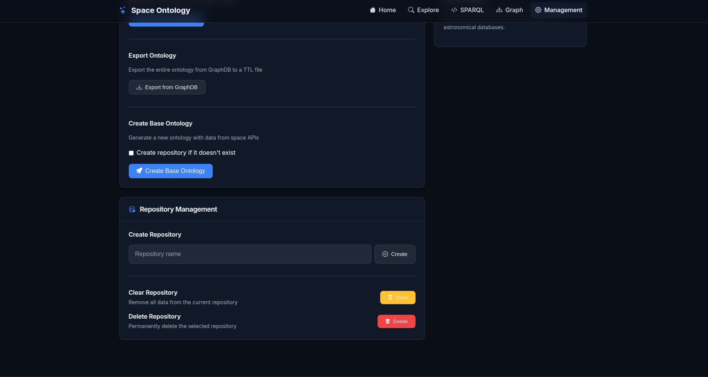

This project is part of the RPCW (Representation and Processing of Knowledge on the Web) course. It focuses on creating and managing an ontology-based system for representing and querying data related to space exploration. The system uses RDF and OWL standards to define and query relationships between entities such as astronauts, space missions, celestial bodies, and more.

---

## Table of Contents

1. [Tools Used](#tools-used)
2. [Development Strategy](#development-strategy)
3. [Technical Implementation](#technical-implementation)
4. [Features](#features)
5. [Pages Overview](#pages-overview)
6. [Dependencies](#dependencies)
7. [How to Run](#how-to-run)
8. [Start Guide](#start-guide)
9. [Authors](#authors)

---

## Tools Used

- **Python 3.10+** — Main language for scripting, data processing, and ontology population.
- **RDFlib** — Python library for manipulating RDF graphs and serializing in Turtle format.
- **Requests** — Python library for making HTTP calls to external APIs (NASA, SpaceX, Wikipedia, etc).
- **Flask** — Web framework for the application's interface.
- **GraphDB** — Triplestore for storing and querying the ontology using SPARQL.
- **SPARQLWrapper** — Python library for executing SPARQL queries against GraphDB endpoints.
- **HTML/CSS/JavaScript** — For the application's frontend, with Bootstrap Icons and CodeMirror for query editing.
- **D3.js** — JavaScript library for creating interactive graph visualizations.
- **External APIs** — NASA, SpaceX, Wikipedia, JPL Small-Body Database, Solar System OpenData.

## Development Strategy

1. **Ontology Modeling**

   - Analysis of the problem domain (space exploration) and identification of key entities: celestial bodies, space missions, astronauts, agencies, spacecraft, etc.
   - Definition of relevant classes, properties, and relationships, following best modeling practices in OWL/RDF.
   - Implementation of the ontology's base structure in Python, using the RDFlib library to ensure flexibility and easy maintenance.

2. **Automatic Ontology Population**

   - Collection of real data from public APIs (NASA, SpaceX, Wikipedia, JPL Small-Body Database, Solar System OpenData).
   - Conversion of the collected data into ontology instances, automatically creating entities and relationships among them.

3. **Persistence and Querying**

   - Serialization of the ontology into a Turtle (`.ttl`) file to facilitate sharing and reuse.
   - Integration with GraphDB for persistent storage and efficient execution of SPARQL queries.
   - Implementation of SPARQL queries for exploration, validation, and knowledge extraction from the ontology.

4. **Web Application Development**

   - Creation of an intuitive web interface using Flask, allowing users to explore, search, and query the ontology.
   - Implementation of features for importing/exporting ontologies, executing custom SPARQL queries, and visualizing relationships through interactive graphical formats.
   - Use of HTML, CSS, and JavaScript to deliver a modern and responsive user experience.

5. **Testing and Validation**

   - Execution of manual and automated tests to ensure data integrity and the correct functioning of queries.
   - Iterative adjustments to ontology modeling and population scripts based on test results and user feedback.
   - Continuous validation of GraphDB integration and the web interface.

This approach ensures a robust, scalable, and user-friendly solution for representing and exploring knowledge in the space domain.

## Technical Implementation

### Architecture Overview

The system follows a modular architecture with clear separation of concerns:

- **Backend Layer**: Flask web application serving as the main controller
- **Data Layer**: GraphDB triplestore for persistent RDF storage
- **Ontology Layer**: RDFlib-based ontology management and SPARQL query execution
- **Frontend Layer**: Interactive web interface with dynamic visualizations

### Core Components

#### 1. Ontology Creator (`app/ontology/creator.py`)

Responsible for building the space ontology structure and populating it with real-world data:

- **Structure Creation**: Defines OWL classes (CelestialBody, Planet, Star, etc.) and properties (orbits, hasMoon, mass, etc.)
- **Data Integration**: Fetches data from multiple APIs:
  - Solar System OpenData API for planets and moons
  - NASA APIs for asteroids, missions, and astronauts
  - SpaceX API for commercial space missions
  - JPL Small-Body Database for comets
  - Wikipedia API for descriptive content
- **RDF Generation**: Converts API data into RDF triples using proper URIs and datatypes

#### 2. Query Engine (`app/ontology/queries.py`)

Handles all SPARQL operations and data retrieval:

- **Dual Mode Operation**: Supports both local RDFlib graphs and remote GraphDB endpoints
- **Query Execution**: Processes SELECT, INSERT, DELETE, and CONSTRUCT queries
- **Data Formatting**: Converts SPARQL results into JSON format for web consumption
- **Relationship Mapping**: Extracts entity relationships for graph visualization

#### 3. Web Interface (`app/routes.py`)

Flask-based REST API providing endpoints for:

- **Repository Management**: Create, configure, and manage GraphDB repositories
- **Data Operations**: Import/export ontologies, execute SPARQL queries
- **Entity Exploration**: Browse classes, instances, and individual entity details
- **Visualization**: Generate graph data for D3.js visualizations

#### 4. Frontend Components

Interactive web pages built with modern web technologies:

- **Graph Visualization**: D3.js force-directed graphs with filtering and search
- **SPARQL Editor**: CodeMirror-based query editor with syntax highlighting
- **Entity Browser**: Hierarchical navigation through ontology structure
- **Management Interface**: GraphDB configuration and ontology lifecycle management

### Data Flow

1. **Ontology Creation**: Creator fetches external data → converts to RDF → stores in GraphDB
2. **Query Processing**: User request → Flask route → Query engine → SPARQL execution → JSON response
3. **Visualization**: Frontend requests graph data → Backend processes relationships → D3.js renders interactive graph
4. **Entity Navigation**: User clicks entity → Detailed SPARQL query → Property/relationship display

### Key Technical Decisions

- **GraphDB Integration**: Chosen for its robust SPARQL 1.1 support and scalability
- **RDFlib Compatibility**: Maintains local graph capability for development and testing
- **API-First Design**: All data operations exposed as REST endpoints for flexibility
- **Responsive Visualization**: Client-side rendering for smooth user interaction

## Features

- **Ontology Management**:

  - Create and manage an ontology structure for space exploration.
  - Define classes, properties, and relationships between entities.
  - Import/export ontologies in Turtle format.

- **SPARQL Query Execution**:

  - Execute SPARQL queries to retrieve data from the ontology.
  - Support for SELECT, INSERT, DELETE, and CONSTRUCT operations.
  - Syntax highlighting and query validation.

- **Graph Visualization**:

  - Generate interactive graph visualizations of entity relationships.
  - Filter by entity type and search functionality.
  - Force-directed layout with customizable physics.

- **Entity Search and Exploration**:

  - Search for entities (e.g., astronauts, missions) by name.
  - Browse ontology hierarchy by classes and instances.
  - Detailed entity pages with properties and relationships.

- **Statistics and Analytics**:

  - Retrieve statistics about the ontology (classes, properties, triples).
  - Monitor repository status and data integrity.

- **Repository Management**:
  - Configure GraphDB connections and repositories.
  - Create new repositories with optimized settings.
  - Clear and reset repository data.

### Pages Overview

Below are brief descriptions of each page developed together with a screenshot:

1. **Home Page**  
   Overview of the application and its features.
   

2. **Explore Page**  
   Explore the ontology visually, navigating through classes, properties, and relationships between entities. Not only that but see statistics about the ontology like how many triples it has, etc.
   

3. **Entity Page**  
   View detailed information about a specific entity, including its properties, relationships, and associated data within the ontology.
   

4. **SPARQL Query Page**  
   Execute SPARQL queries and view results.
   

5. **Graph Page**  
   Visualize the ontology as an interactive graph, showcasing entities and their relationships.
   
   

6. **Management Page**  
   The Management Page allows users to manage the application's connection to GraphDB and perform ontology-related operations. Users can:

   - Configure the GraphDB host, port, and repository.
   - Test the connection to GraphDB.
   - Create new repositories or select existing ones.
   - Import ontology files into GraphDB.
   - Export the ontology from GraphDB to a Turtle (`.ttl`) file.
   - Create a base ontology populated with data from external APIs.
   - Clear repository data.

   
   

---

## Dependencies

The project dependencies are listed in the `requirements.txt` file. To install them, run the following command:

```bash
pip install -r requirements.txt
```

Key dependencies include:

- `Flask` - Web framework
- `rdflib` - RDF graph manipulation
- `SPARQLWrapper` - SPARQL query execution
- `requests` - HTTP API calls
- `werkzeug` - WSGI utilities

## How to Run

### Prerequisites

1. **Python 3.10+** installed on your system
2. **GraphDB** server running (download from Ontotext)
3. Internet connection for API data fetching

### Installation Steps

1. Clone the repository:

```bash
git clone <repository-url>
cd RPCW_TP
```

2. Install dependencies:

```bash
pip install -r requirements.txt
```

3. Start GraphDB server (typically on port 7200)

4. Run the application:

```bash
python3 run.py
```

5. Access the application at `http://localhost:5000`

## Start Guide

This guide provides a quick sequence of steps to begin configuring and using the application.

### Step 1: Setup GraphDB Connection

1. Navigate to the **Management** page
2. Configure GraphDB connection (default: localhost:7200)
3. Test the connection to ensure GraphDB is accessible
4. Create a new repository or select an existing one

### Step 2: Create Base Ontology

1. In the Management page, click "Create Base Ontology"
2. Wait for the system to fetch data from external APIs
3. The system will automatically populate the ontology with:
   - Solar system planets and moons
   - Thousands of exoplanets
   - Space missions from NASA and SpaceX
   - Astronauts and spacecraft
   - Asteroids and comets

### Step 3: Explore the Data

1. Visit the **Explore** page to see ontology statistics
2. Browse classes and instances
3. Use the **Graph** page for visual exploration
4. Try the **SPARQL** page for custom queries

### Step 4: Query and Analyze

1. Execute predefined SPARQL queries
2. Create custom queries to extract specific information
3. Use the entity pages to dive deep into individual objects
4. Export data or ontology as needed

It is essential to strictly follow steps 1 and 2 to ensure proper and effective setup of the application's working environment.

## Authors

- [**João Coelho: PG55954**](https://github.com/JoaoCoelho2003)
- [**Mariana Silva: PG55980**](https://github.com/MarianaSilva659)
- [**José Rodrigues: PG55969**](https://github.com/FilipeR13)
